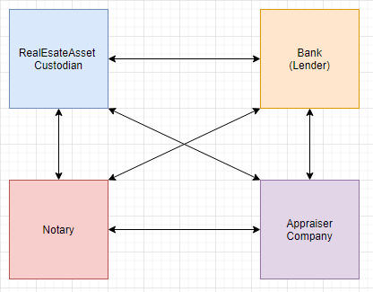
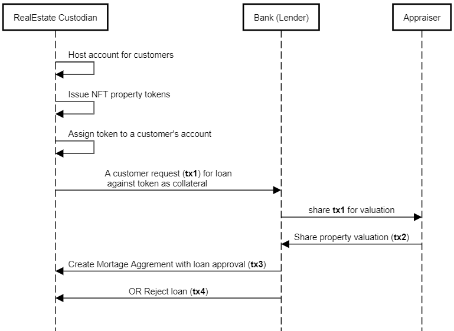

# Mortgage Origination CorDapp (Collateralize NFT)

It is very simple usecase for loan origination process for real estate property.

##### CorDapp is designed to `Pledge` the `NFT Token` (of RealEstateProperty type) as a `collateral` for loan from Bank party.
 
## Nodes and Network Parties

* **RealEstateAsset Custodian**: A `custodian` who issues the real estate property `NFT tokens` on a ledger. It is also host `customer accounts` who are actual `owner` issued Property Token/Asset.
* **Bank**: It is acting as `lender` offers the loans against real estate NFT as a collateral. 
* **Appraiser Company**: has expertise in `property valuation` and respond to valuation request from bank(lender). 
* **Notary**: attestation party on network, provide the UTXO algorithm to avoid double spend and integrity of ledger. 

## Sequence diagrams  

## Software versions
You will need the following installed on your machine before you can start:

* **Java 8**
* **Corda 4.8** 
* Platform version 10
* H2 DB

## Corda Features used:
* Token SDK
* Account SDK
* Schedulable State And Flow
* QueryableState and Schema Design
* 

## Getting Set Up

To get started, clone this repository with:

     git clone https://github.com/balajimore/mortgage-origination

And change directories to the newly cloned repo:

     cd mortgage-origination

## Building the CorDapp template:

**Unix:** 

     ./gradlew deployNodes

**Windows:**

     gradlew.bat deployNodes

Note: You'll need to re-run this build step after making any changes to
the template for these to take effect on the node.

## Running the Nodes

Once the build finishes, change directories to the folder where the newly
built nodes are located:

     cd build/nodes

The Gradle build script will have created a folder for each node. You'll
see three folders, one for each node and a `runnodes` script. You can
run the nodes with:

**Unix:**

     ./runnodes --allow-hibernate-to-manage-app-schema --log-to-console --logging-level=DEBUG

**Windows:**

    runnodes.bat --allow-hibernate-to-manage-app-schema --log-to-console --logging-level=DEBUG

You should now have four Corda nodes running on your machine serving 
this CorDapp.

When the nodes have booted up, you should see a message like the following 
in the console: 

    Node started up and registered in 5.007 sec

## CorDapp testing via Corda Shell using Flows

Let's start with creating `account` for a `customer` on `Custodian` node:

    flow start CreateNewAccount accountName: "Uday"

Switch to `BankA` node shell, create `account` for Bank's `Credit Administration Department` (who approves loan) On Bank Node run following command to create account for Credit Administration Department (who approves loan):
	
	flow start CreateNewAccount accountName: "CreditAdminsDept1"

You can run following query see the accounts created and shared to nodes: 

    run vaultQuery contractStateType: com.r3.corda.lib.accounts.contracts.states.AccountInfo

By default, its sharing account created to all nodes in network. 

Now switch to `Custodian Node` again:

It is time to create the `Non-Fungible-Token` (`NFT`) for our `Real Estate Property`:

	flow start IssueNftTokenTo propertyValue: "$100000", constructionArea: "1200 SQFT", propertyAddress: "KP Park Pune", issueToAccName: "Uday"
	
As result flow returns `nftPropertyTokenId`, backup it, would be used further to request for loan. For example:

	 nftPropertyTokenId: ad1e21be-bc1b-4247-a9f2-f996dad93a6d

Now we have accounts, we have Token created, we can use this info to `request for loan` against given `token` to the Bank.

    flow start LoanRequestTo nftPropertyTokenId: "<ad1e21be-bc1b---CHANGE-THIS--4247-a9f2-f996dad93a6d>",  creditAdminDeptAccName: "CreditAdminsDept1", loanAmount: "$60000"

On successful placing the request, flow returns the `LoandId`, back up this as well. For example: 
	
	LoanId: f3e398aa-ccc0-4d90-8df9-5549edc0e1b7
	
To see the `loan state` created you can run following command on `Custodian` and `Bank` node.

    run vaultQuery contractStateType: net.synechron.cordapp.morigin.state.LoanState

Now `Bank` and `Appraisal` node has some flows scheduled to be executed automatically on receiving of `LoanState`.
So give it some time (couple of seconds) to complete.

	This is required as Bank and Appraiser nodes has some scheduled flow to be executed on creation on LoanState. 
	Actually, Bank execute scheduled flow as soon as it sees LoanState(status = PENDING), to create PropertyValuation state 
	and shares it with an Appraiser Node.
	Appraiser node on receiving request from Bank, it calcuate some ranged random market valuation for given property. 
	And share it back updated PropertyValuation state to Back node for further processing.
	
You can query the `valuation` received on `Bank` node:

    run vaultQuery contractStateType: net.synechron.cordapp.morigin.state.PropertyValuation

Now you have property valuation, use this amount to sanction the loan (i.e. <= valuation)

    flow start LoanSanction loanId: "<f3e398aa-ccc0---CHANGE--THIS--4d90-8df9-5549edc0e1b7>", sanctionAmount: "$55000"

### Encumbered NFT Token and Encumbrance LoanState 
On an approval of loan Bank does lock the Token state using Encumbered/Encumbrance way. 
The two-way cyclic lock that avoid Token being misused for other purpose, it is pledged under the `agreement` against loan taken by `Token` `holder/owner`.

Run following commands to see updated states and encumbrance index:
 
    run vaultQuery contractStateType: net.synechron.cordapp.morigin.state.RealEstateProperty
    run vaultQuery contractStateType: net.synechron.cordapp.morigin.state.LoanState
